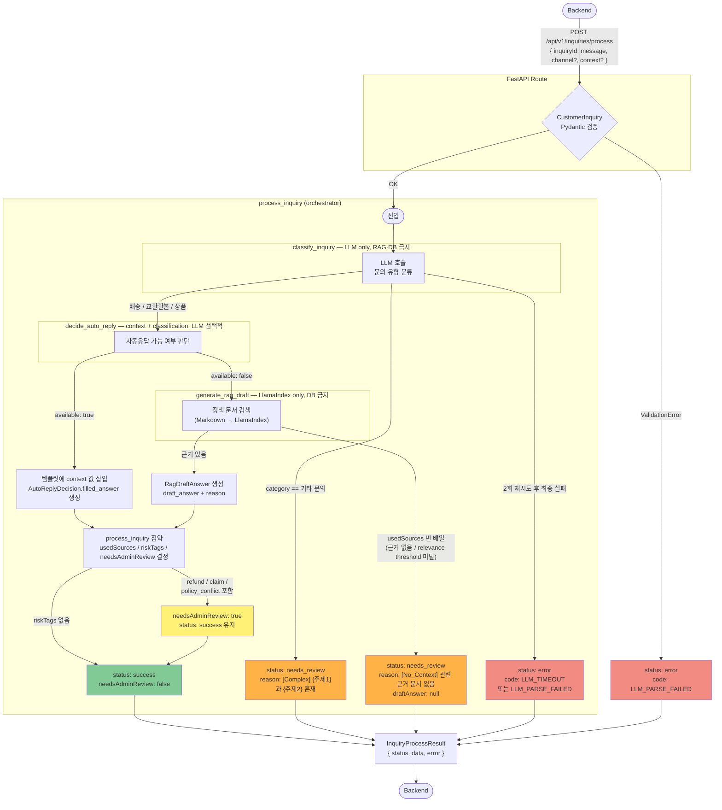
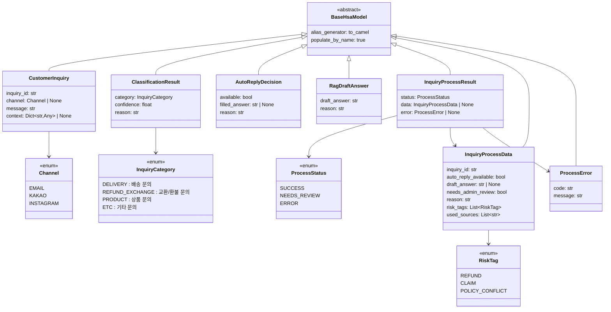

# HSA AI 처리 흐름

## api-contract v1 → v2 변경 요약

`docs/api-contract-v2.md`가 외부 계약의 단일 출처(single source of truth)다.
`docs/api-contract.md`(v1)는 히스토리 보존 목적으로만 유지하며 새 작업에서는 참조하지 않는다.

| 항목 | 기존 (v1) | 현재 (v2) |
| --- | --- | --- |
| 엔드포인트 | `POST /api/v1/answers/draft` | `POST /api/v1/inquiries/process` |
| 필드 컨벤션 | snake_case | camelCase (AGENTS.md 이중 컨벤션 준수) |
| 응답 구조 | flat | `status / data / error` 래퍼 |
| 응답 필드 추가 | — | `autoReplyAvailable` |
| 관리자 검토 조건 | — | `policy_conflict` 추가, LLM 실패는 `error`로 분리 |
| 에러 응답 | 미정의 | 오류 코드 구조 신규 정의 |

---

## 전체 처리 흐름

### 출력 상태별 응답 구조

| `status` | `data` | `error` | 발생 조건 |
| --- | --- | --- | --- |
| `success` | 채워짐 | `null` | 자동응답 또는 RAG 초안 생성 성공 |
| `needs_review` | 채워짐 | `null` | 근거 없음 또는 복합 문의 |
| `error` | `null` | 채워짐 | LLM 호출 실패, Pydantic 검증 실패 등 |

---

## 스키마 구조

### 함수-스키마 매핑

각 함수의 입출력 타입과 호출 경계를 정리한다.

| 함수 | 입력 | 출력 | 허용 외부 호출 |
| --- | --- | --- | --- |
| `process_inquiry` | `CustomerInquiry` | `InquiryProcessResult` | 아래 3개 함수 |
| `classify_inquiry` | `CustomerInquiry` | `ClassificationResult` | LLM만 |
| `decide_auto_reply` | `CustomerInquiry`, `ClassificationResult` | `AutoReplyDecision` | context + LLM 선택적 |
| `generate_rag_draft` | `CustomerInquiry` | `RagDraftAnswer \| None` | LlamaIndex만 |

`usedSources`, `needsAdminReview`, `riskTags` 결정은 `process_inquiry`만 수행한다.

---

### 클래스 다이어그램

---

### 스키마별 필드 상세

#### CustomerInquiry — 백엔드 요청 입력

| 필드 (snake_case) | 외부 JSON (camelCase) | 타입 | 필수 | 설명 |
| --- | --- | --- | --- | --- |
| `inquiry_id` | `inquiryId` | `str` | 필수 | 백엔드 문의 고유 ID |
| `message` | `message` | `str` | 필수 | 고객 문의 원문. 최대 2,000자 |
| `channel` | `channel` | `Channel \| null` | 선택 | 유입 채널 |
| `context` | `context` | `object \| null` | 선택 | 운영 데이터 맥락. 키는 camelCase |

#### ClassificationResult — 문의 분류 결과 (내부)

| 필드 | 타입 | 설명 |
| --- | --- | --- |
| `category` | `InquiryCategory` | 분류 유형. `기타 문의`이면 `needs_review` 처리 |
| `confidence` | `float` (0~1) | LLM 자가 보고 신뢰도. PoC에서는 참고용 |
| `reason` | `str` | 분류 근거 |

#### AutoReplyDecision — 자동응답 판단 결과 (내부)

| 필드 | 타입 | 설명 |
| --- | --- | --- |
| `available` | `bool` | 자동응답 가능 여부 |
| `filled_answer` | `str \| null` | 템플릿에 context 값을 삽입한 완성 응답. `available=true`일 때만 채움 |
| `reason` | `str` | 판단 근거 |

> model_validator: `available=true`이면 `filled_answer` 필수. `available=false`이면 `filled_answer`는 `None`이어야 한다.

#### RagDraftAnswer — RAG 초안 (내부)

| 필드 | 타입 | 설명 |
| --- | --- | --- |
| `draft_answer` | `str` | 답변 초안 본문 |
| `reason` | `str` | 초안 작성 근거 요약 |

> `usedSources`가 빈 배열이면 이 모델 자체를 생성하지 않고 `None` 반환.

#### InquiryProcessData — 응답 data 필드

| 필드 (snake_case) | 외부 JSON (camelCase) | 타입 | 소스 |
| --- | --- | --- | --- |
| `inquiry_id` | `inquiryId` | `str` | 입력 그대로 |
| `auto_reply_available` | `autoReplyAvailable` | `bool` | `AutoReplyDecision.available` |
| `draft_answer` | `draftAnswer` | `str \| null` | 자동응답: `filled_answer` / RAG: `draft_answer` / 근거 없음: `null` |
| `needs_admin_review` | `needsAdminReview` | `bool` | riskTags 또는 검토 조건 해당 시 `true` |
| `reason` | `reason` | `str` | 자동응답: `AutoReplyDecision.reason` / RAG: `RagDraftAnswer.reason` / 검토: `[No_Context]` 또는 `[Complex]` 태그 |
| `risk_tags` | `riskTags` | `RiskTag[]` | `refund` \| `claim` \| `policy_conflict` |
| `used_sources` | `usedSources` | `str[]` | `context.{필드명}` \| `policy.{파일명}` \| `faq.{문서ID}` |

#### ProcessError — 오류 응답 error 필드

| 필드 | 타입 | 코드 후보 |
| --- | --- | --- |
| `code` | `str` | `LLM_TIMEOUT` \| `LLM_PARSE_FAILED` \| `EXTERNAL_SYSTEM_ERROR` |
| `message` | `str` | 오류 상세 메시지 |